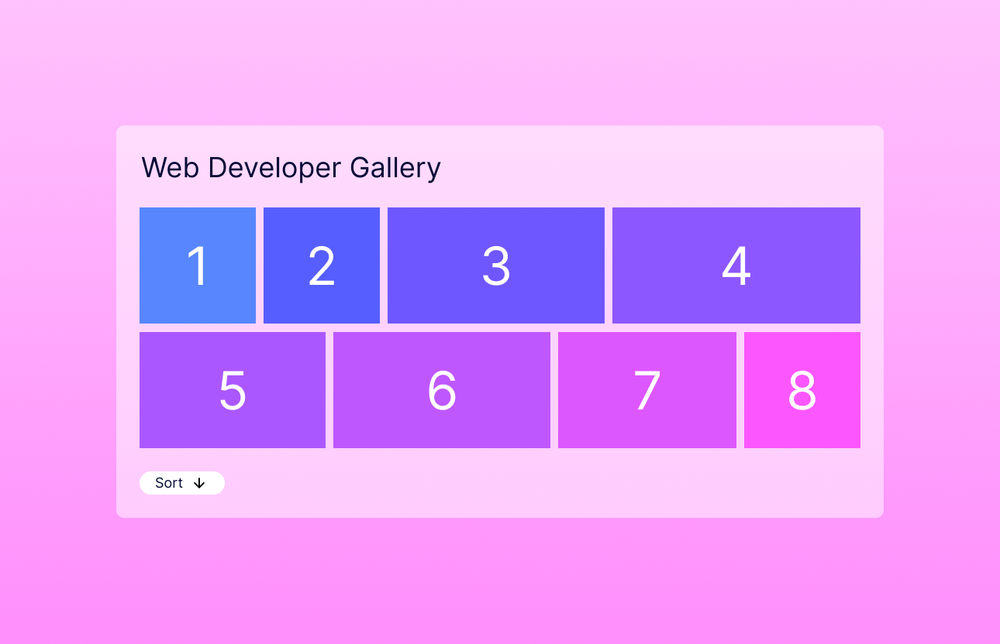

# Web Developer Task

Hi there! Today's task is to replicate a simple gallery page in a starter Next.js app. 

You can refer to the design.png file in this repository or use a figma design you can find [here](https://www.figma.com/design/cqwIYXNHitVg2nAlMBfObA/Web-Developer-Test?node-id=0-1&t=nQJuZMDmryzLddLl-1)

Please make meaningful commits at multiple points in your process, however please **DO NOT PUSH** commits to `origin` until the end of the day (to avoid other candidates gaining access to your work)

This project uses [`next/font`](https://nextjs.org/docs/basic-features/font-optimization) to automatically optimize and load Inter, a custom Google Font.

# Steps

1. Please fork this repository, choosing to 'contribute to the parent project' if prompted, and pull the code to your machine
2. To install and run the app either
   1. `npm install` and then `npm run dev`
   2. `yarn install` and then `yarn dev`
3. Edit the ./app/page.tsx file - you can add other files for new react components if you'd like - making a page as close as possible to the design shown. The page should display the images and have a button that reverses the sorting
4. Use the hook useGalleryData (`./lib/useGalleryData') to load the image data - but BEWARE, the JSON data used by the hook has a problem, please fix that!
5. **IMPORTANT** - please make meaningful commits at multiple points in your process, however please **DO NOT PUSH** commits to `origin` until the end of the day (to avoid other candidates gaining access to your work)

# Additional Backend Task

Alongside the front-end gallery exercise, you are to complete a small Node.js backend assignment that focuses on JWT-based authentication. The goal is to build and document an Express.js API, leaving implementation details for you:

1. **Seeded user**: Initialize the app with a single user whose password is stored as a bcrypt hash (in-memory or via a simple JSON file).
2. **Login endpoint**: Implement `POST /auth/login` to validate credentials and return a signed access JWT that includes the user ID and role.
3. **Refresh endpoint**: Implement `POST /auth/refresh` that accepts a refresh token (store refresh tokens in memory during runtime) and issues a new access token when valid.
4. **Protected profile**: Implement `GET /profile`, guarded by middleware that checks the `Authorization` bearer token, returning the user’s public details when the token is valid.
5. **JWT middleware**: Create reusable middleware to verify JWTs, attach the decoded payload to `req.user`, and respond with appropriate HTTP status codes for errors or expired tokens.
6. **Instructions**: Update the README with concise steps showing how to run the server and test the endpoints using curl or Postman.

You would be expected to demonstrate your implementation and understanding during the exercise.
